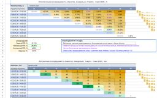
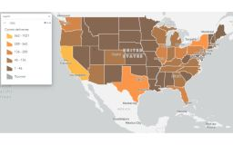
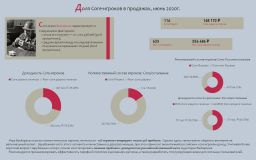
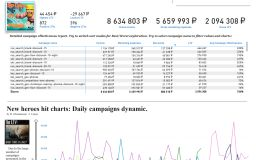
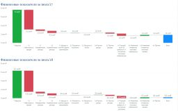
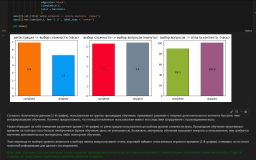
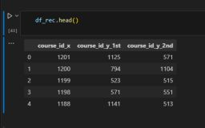

# Portfolio
Портфолио учебных работ на курсе "Аналитик данных"

* <a href="https://docs.google.com/spreadsheets/d/1Jp-ZbCn7x0XfeTK719f4IlE49PCwJcGE926y4H2fmjo/edit?usp=sharing"><b>"Анализ бизнес-модели"</b></a> - Проектная работа. Анализ маркетинговых и продуктовых показателей (Google Sheets, когортный анализ, юнит-экономика)
 
    </img> 
 
* <a href="Исследование эффективности продаж.pdf"><b>"Исследование эффективности продаж.pdf"</b></a> - Проектная работа. Анализ динамики продаж и эффективности логистики поставок (SQL, Power BI)
 
    </img> 
 
* <a href="GameDev сегментация игроков.pdf"><b>"GameDev сегментация игроков.pdf"</b></a> - Практическая работа по сегментации клиентов игрового приложения (Power BI, сегментация, когортный анализ)
 
    </img> 
 
* <a href="GameDev LTV.pdf"><b>"GameDev LTV.pdf"</b></a> - Самостоятельная работа. Дашборд для оценки эффективности маркетинговых активностей по критерию LTV (Power BI).  
 
    </img> 
 
* <a href="Финансовая аналитика.pdf"><b>"Финансовая аналитика.pdf"</b></a> - Практическая работа. Агрегация оборотов в финансовый отчет, сравнение финансовых показателей (Power BI, финансовый анализ)
 
    </img> 
 
* <a href="GameDev анализ воронки.ipynb"><b>"GameDev анализ воронки.ipynb"</b></a> - Проектная работа. Исследование поведения пользователей в мобильной игре (Jupiter Notebook, Python, Pandas)
 
    </img> 
   
* <a href="EdTech рекомендательная система.ipynb"><b>"EdTech рекомендательная система.ipynb"</b></a> - Проектная работа. Разработка рекомендательной системы для клиентов учебной платформы с целью увеличения среднего чека (Jupiter Notebook, SQL,  Python, Pandas).
 
    </img> 
 

