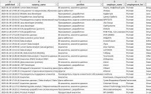

 - <a href="https://docs.google.com/spreadsheets/d/1Jp-ZbCn7x0XfeTK719f4IlE49PCwJcGE926y4H2fmjo/edit?usp=sharing"><i>"Анализ бизнес-модели"</i></a>

     Проектная работа. Анализ маркетинговых и продуктовых показателей (<strong>Google Sheets</strong>, когортный анализ, юнит-экономика).

- <a href="Исследование эффективности продаж.pdf"><i>"Исследование эффективности продаж"</i></a> 

    Проектная работа. Анализ динамики продаж и эффективности логистики поставок (SQL, <strong>Power BI</strong>).

- <a href="GameDev сегментация игроков.pdf"><i>"GameDev: сегментация игроков"</i></a>
    
    Практическая работа по сегментации клиентов игрового приложения (<strong>Power BI</strong>, сегментация, когортный анализ). Печатная копия дашборда.

- <a href="GameDev LTV.pdf"><i>"GameDev: LTV"</i></a> 

    Самостоятельная работа. Дашборд для оценки эффективности маркетинговых активностей по критерию LTV (<strong>Power BI</strong>), печатная копия.  

- <a href="Финансовая аналитика.pdf"><i>"Финансовая аналитика"</i></a> 
    
    Практическая работа. Агрегация оборотов в финансовый отчет, сравнение финансовых показателей (<strong>Power BI</strong>, финансовый анализ). Печатная копия дашборда.

- <a href="GameDev анализ воронки.ipynb"><i>"GameDev: анализ воронки"</i></a> 

    Проектная работа. Исследование поведения пользователей в мобильной игре (<strong>Jupiter Notebook</strong>, Python, Pandas).

- <a href="EdTech рекомендательная система.ipynb"><i>"EdTech: рекомендательная система кросс-продаж"</i></a> 

    Проектная работа. Разработка рекомендательной системы для клиентов учебной платформы с целью увеличения среднего чека (<strong>Jupiter Notebook</strong>, SQL, Python, Pandas).
    

<h3>Иные проекты:</h3>

-  

    Личный pet-проект. Увеличение скорости нахождения вакансий, формирование отчета в сжатой табличной форме без визуального шума (<strong>Jupiter Notebook</strong>, Python, Pandas).
    

